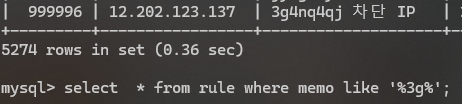
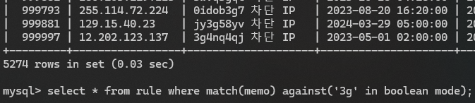
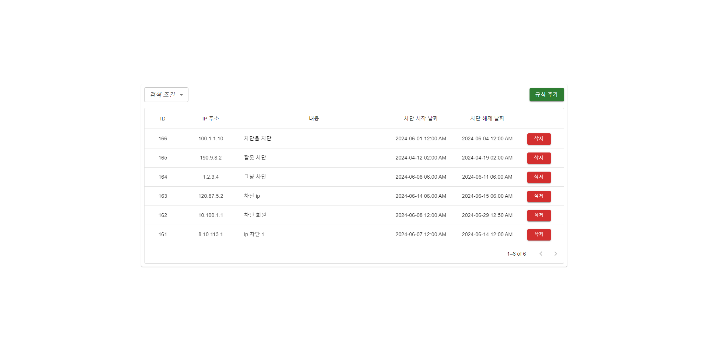
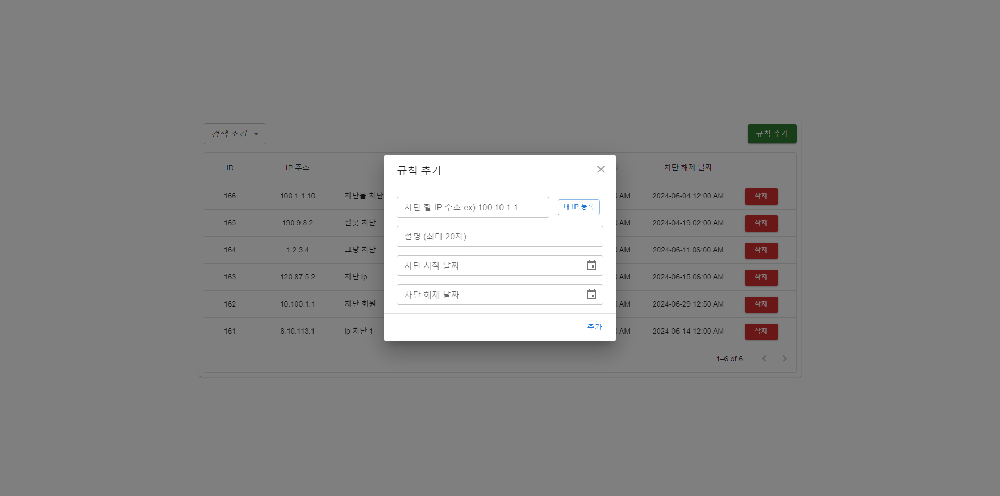

# access-manager

허용 IP 및 시간대를 설정 및 제한할 수 있는 어드민 페이지

## 개발 환경

- JAVA 17
- React 18
- Spring Boot 3.3.0
- MySQL 8.0.37
- IntelliJ IDEA 2023.3.5

## 구현 내용

### [등록 시간 처리](https://github.com/yewl1110/access-manager/blob/dev/client/README.md)

- 시간 처리는 dayjs와 utc 플러그인을 사용했습니다.
- 서버에서는 UTC 시간만 다루도록 구현했습니다.
- 클라이언트에서는 UTC값을 가져와 사용했고, 시간을 표기 시 local time으로 변환하여 출력했습니다. (state에 있는 데이터는 utc입니다.)

### DB 인덱스 적용

- 내용 검색 시 테이블 풀스캔을 방지하기 위해 문자열을 저장하는 memo 컬럼에 ngram fulltext index를 적용했습니다.
  - 적용 전
  - 
  - 적용 후
  - 

## 화면

